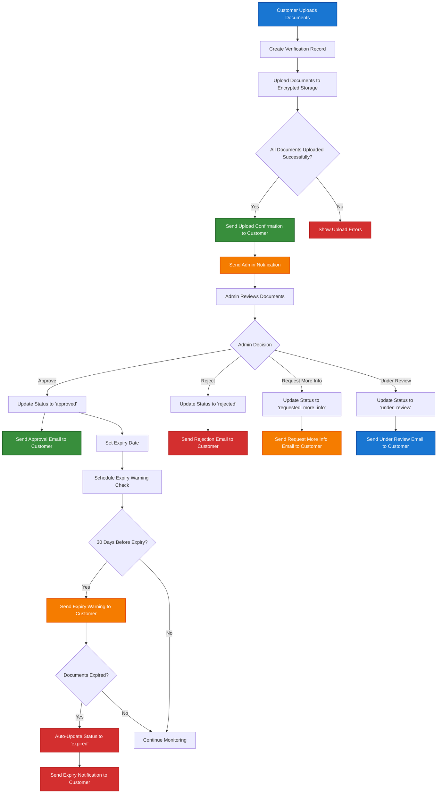

# KYC Secure Upload (PrestaShop Module)

Open source, GDPR-compliant KYC document verification for PrestaShop.

- Proof of identity (ID)
- Proof of address (utility bill, bank statement, etc.)
- Secure file storage with encryption
- Product order blocking until KYC is validated

## Requirements

### PrestaShop Compatibility
- **PrestaShop:** 8.0.0 - 8.99.99
- **PHP:** 8.1 or higher

### PHP Extensions
This module uses standard PrestaShop-required PHP extensions:

- **fileinfo** - For MIME type detection of uploaded documents
- **openssl** - For AES-256-CBC document encryption
- **curl** - For HTTP requests (standard PrestaShop requirement)
- **gd** - For image processing (standard PrestaShop requirement)
- **json** - For configuration data (standard PrestaShop requirement)
- **mbstring** - For string handling (standard PrestaShop requirement)

*All listed extensions are standard PrestaShop 8 requirements, so no additional server configuration is needed.*

## Features

- [x] Secure KYC file uploads (ID, proof of address)
- [x] End-to-end file encryption (OpenSSL)
- [x] Front-office upload & status tracking
- [x] Back-office admin panel: validation, document checking, logs
- [x] Order blocking for sensitive products until KYC is validated
- [x] Easy installation, configuration, and uninstall
- [x] Multi-language ready
- [x] Automated email notifications (status updates, document confirmations, admin alerts)

## Installation

1. Download the latest release ZIP
2. Upload to your PrestaShop back office (Modules > Module Manager > Upload)
3. Configure in the modules section

## Security

- Files are stored encrypted with OpenSSL (`AES-256-CBC`)
- Keys and IV managed securely
- .htaccess restricts direct access
- GDPR retention and deletion supported

## Email Flow Diagram

## Email Types Summary

| Email Type | Trigger | Recipient | Template | Purpose |
|------------|---------|-----------|----------|---------|
| **Upload Confirmation** | Document upload success | Customer | `document_upload_confirmation` | Confirm receipt |
| **Admin Notification** | Document upload success | Admins | `admin_new_verification` | Alert for review |
| **Status Change** | Admin updates status | Customer | `verification_status` | Notify of decision |
| **Expiry Warning** | 30 days before expiry | Customer | `verification_expiry_warning` | Renewal reminder | 

## Email Templates

Email templates are located in:
- Text versions: `mails/{lang}/`
- HTML versions: `mails/layouts/`

Available languages: `en`, `fr`

### ⚠️ Known Issue: Email Template Generation

There is a known bug in PrestaShop 8.1.2 preventing email template generation for custom modules through the admin interface. Email sending functionality works normally.

**Details:** [PrestaShop Issue #35214](https://github.com/PrestaShop/PrestaShop/issues/35214)

## Contribution

PRs welcome! See [CONTRIBUTING.md](CONTRIBUTING.md) for guidelines.

## License

MIT License. See [LICENSE.md](LICENSE.md) for details.

